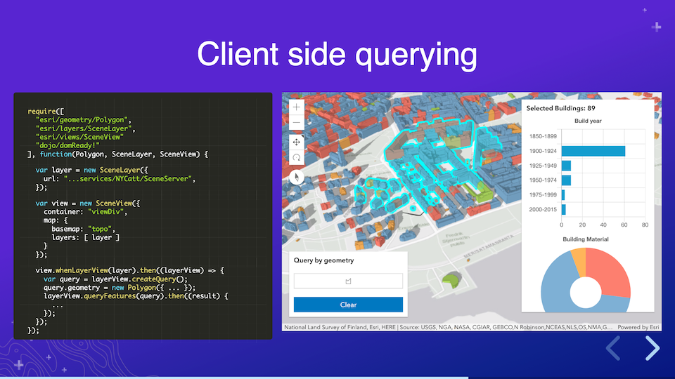
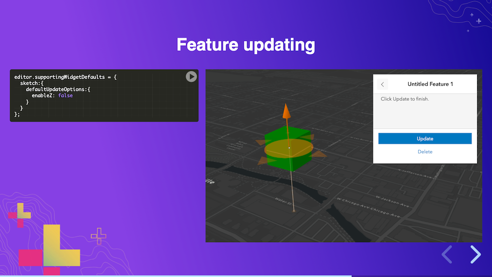
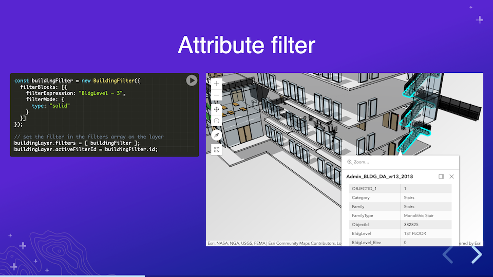

# 3D ArcGIS API for JavaScript

This repository contains some of the 3D [ArcGIS API for JavaScript](https://developers.arcgis.com/javascript/) sessions that were shown at the virtual Esri Developer Summit 2020. The presentations are created with reveal.js, featuring interactive samples for which the source code can be found in this repository.

The full 2020 Developer Summit [technical session playlist](https://www.youtube.com/playlist?list=PLaPDDLTCmy4Ys8vfmC7DbX3FHSsyosvh7) is available on YouTube.

### [Fundamentals for Building 3D Web Apps](https://esri.github.io/devsummit-2020-3D-jsapi/fundamentals-3d-web-apps.html)

Javier Gutierrez, Esri R&D Center Zürich 
Thomas Other, Esri R&D Center Zürich

Recording: https://www.youtube.com/watch?v=zo3wPofGN-0

Discover the 3D capabilities of the ArcGIS API for JavaScript and learn how to leverage them to build stunning 3D web applications. This session will focus on the fundamental 3D building blocks of the API: SceneView, 2D and 3D layers, terrain, and symbology.

### [Web Editing in 2D and 3D](https://esri.github.io/devsummit-2020-3D-jsapi/web-editing.html)

Jonathan Uihlein, Esri 
Heather Gonzago, Esri 
David Koerner, Esri R&D Center Zürich

[First part (2D)](https://bit.ly/2PKX5Mx) | [Second part (3D)](https://esri.github.io/devsummit-2020-3D-jsapi/web-editing.html) 
Recording: https://www.youtube.com/watch?v=m0m7F8FuAlc

Discover the next-generation web editing experience using version 4 of the ArcGIS API for JavaScript. You will learn how to enable and customize the API's editing components as well as create custom web mapping applications for various editing scenarios.

### [Create 3D planning web apps using BIM- and editing capabilities](https://esri.github.io/devsummit-2020-3D-jsapi/bim-editing-web-apps.html)

David Koerner, Esri R&D Center Zürich 
Arno Fiva, Esri R&D Center Zürich

Recording: https://www.youtube.com/watch?v=maEXHMI9ddQ

Urban development processes often involve large interest groups and sometimes even the citizens themselves. This is where 3D based web application play an important role, as they are accessible yet intuitive. Using a range of 3D components, such as BuildingSceneLayers, editing feature layers and analysis tools, we can build powerful yet simple to use apps that run in the browser. In this session we will look at an example use case and deep dive into the application code.

## Installation & Contributing

Esri welcomes contributions from anyone and everyone. Please see[CONTRIBUTING.md](https://github.com/Esri/devsummit-2020-3D-jsapi/blob/master/CONTRIBUTING.md) for more details.

## Licensing
Copyright 2020 Esri

Licensed under the Apache License, Version 2.0 (the "License");
you may not use this file except in compliance with the License.
You may obtain a copy of the License at

   http://www.apache.org/licenses/LICENSE-2.0

Unless required by applicable law or agreed to in writing, software
distributed under the License is distributed on an "AS IS" BASIS,
WITHOUT WARRANTIES OR CONDITIONS OF ANY KIND, either express or implied.
See the License for the specific language governing permissions and
limitations under the License.

A copy of the license is available in the repository's [license.txt](./license.txt) file.
