<!-- .slide: data-background="images/bg-1.png" data-title="add-scene-layer" class="title" -->

# ArcGIS API for JavaScript
## Create 3D planning web apps using <br />BIM- and editing capabilities


David Koerner, Esri R&D Center Zürich \
Arno Fiva, Esri R&D Center Zürich

2020 ESRI DEVELOPER SUMMIT​ | Palm Springs, CA

---

<!-- .slide: data-background="images/bg-4.png" -->

https://esri.github.io/devsummit-2020-3D-jsapi

---

<!-- .slide: data-background="images/bg-3.png" -->

## Agenda

- Visualizing BIM models
- Interactive tools
- Feature layer editing

---

<!-- .slide: data-background="images/bg-2.png" -->

## 3D BIM models in the browser

<div class="two-columns">
  <div class="left-column">

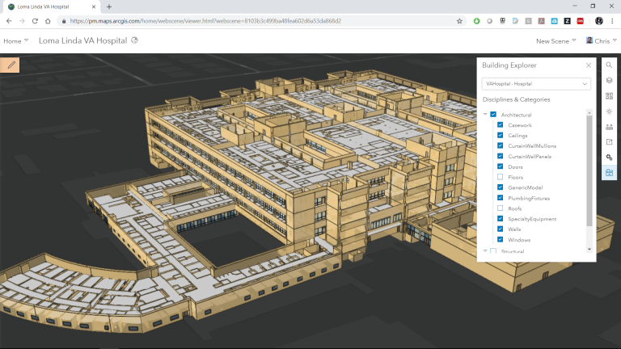

  </div>
  <div class="right-column">


* Share with anyone <!-- .element class="fragment" -->
* Intuitive to use through web apps <!-- .element class="fragment" -->
* Broad device support thanks to WebGL <!-- .element class="fragment" -->


  </div>
</div>


---

<!-- .slide: data-background="images/bg-2.png" -->

## Import BIM models

<div class="fragment">

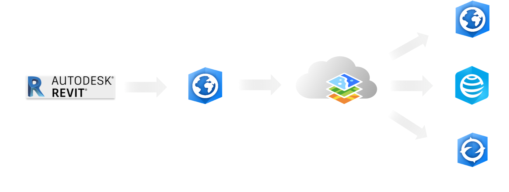

[Online resources](https://pro.arcgis.com/en/pro-app/help/data/revit/)

</div>

---


<!-- .slide: data-background="images/bg-2.png" -->

## i3s BuildingSceneLayer

https://github.com/Esri/i3s-spec/blob/master/docs/1.7/BSL_ReadMe.md

<a href="https://github.com/Esri/i3s-spec/blob/master/docs/1.7/BSL_ReadMe.md" target="_blank">


</a>


---

<!-- .slide: data-background="images/bg-4.png" -->

## Visualizing BIM models

---

<!-- .slide: data-background="images/bg-2.png" -->

<!-- ### Example Building Scene Layer -->

<a href="https://www.arcgis.com/home/item.html?id=64f68adf72474330b195ba2718a8d3e0" target="_blank">


</a>

---

<!-- .slide: data-background="images/bg-2.png" data-title="slide-load-bsl"  -->

## Load BIM model

<div class="two-columns">
  <div class="left-column">

<div class="code-snippet">
<button class="play" id="addBuildingSceneLayer"></button>

```ts
// Load using portal item
const buildingLayer = new BuildingSceneLayer({
  portalItem: {
    id: "64f68adf72474330b195ba2718a8d3e0"
  }
});

// Add to scene
map.add(buildingLayer);
```

<div class="code-snippet fragment">
<button class="play" id="filterBuildingSceneLayer"></button>

```ts
// Iterate through all sublayers
buildingLayer.allSublayers.forEach(subLayer => {

  const name = subLayer.modelName;
  if (name === "Floors" || name.startsWith("Structural")) {
    subLayer.visible = true;
  } else {
    subLayer.visible = subLayer.type === "building-group"
  }
});
```

[i3s model names](https://github.com/Esri/i3s-spec/blob/master/docs/1.7/subLayerModelName.md)
</div>

</div>


  </div>
  <div class="right-column">
    <iframe data-src="./samples/bim-editing/visualization/" ></iframe>
  </div>
</div>


---

<!-- .slide: data-background="images/bg-2.png" data-title="slide-bsl-renderer" -->

## Renderer

<div class="two-columns">
  <div class="left-column">

<div class="code-snippet">
<button class="play" id="renderBuildingSceneLayer"></button>

```ts
// Find window sublayer
const windowLayer = buildingLayer
  .allSublayers.find(l => l.title === "Windows");

// Color windows green
windowLayer.renderer = new SimpleRenderer({
  symbol: new MeshSymbol3D({
    symbolLayers: [
      new FillSymbol3DLayer({
        material: {
          color: [0, 255, 0, 0.8],
        },
        edges: new SolidEdges3D({
          color: [0, 120, 0],
          size: 1,
        })
      })
    ]
  })

});

```


</div>


  </div>
  <div class="right-column">
    <iframe data-src="./samples/bim-editing/visualization/" ></iframe>
  </div>
</div>


---

<!-- .slide: data-background="images/bg-2.png" data-title="slide-bsl-filter-blocks" -->

## Attribute filter

<div class="two-columns">
  <div class="left-column">

<div class="code-snippet">
<button class="play" id="filterFloor"></button>

```ts
const buildingFilter = new BuildingFilter({
  filterBlocks: [{
    filterExpression: "BldgLevel = 3",
    filterMode: {
      type: "solid"
    }
  }]
});

// set the filter in the filters array on the layer
buildingLayer.filters = [ buildingFilter ];
buildingLayer.activeFilterId = buildingFilter.id;

```


</div>


  </div>
  <div class="right-column">
    <iframe data-src="./samples/bim-editing/visualization/" ></iframe>
  </div>
</div>

---

<!-- .slide: data-background="images/bg-2.png" data-title="slide-bsl-filter-modes" -->

## Filter modes

<div class="two-columns">
  <div class="left-column">

<div class="code-snippet">
<button class="play" id="filterFloorXRay"></button>

```ts
buildingFilter.filterBlocks.add({
  filterExpression: "BldgLevel < 5",
  filterMode: {
    type: "x-ray"
  }
});
```

</div>
<div class="code-snippet">
<button class="play" id="filterFloorWireFrame"></button>

```ts
buildingFilter.filterBlocks.add({
  filterExpression: "BldgLevel < 5",
  filterMode: {
    type: "wire-frame",
    edges: {
      type: "solid",
      color: [105, 142, 179, 1]
    }
  }
});
```

</div>


  </div>
  <div class="right-column">
    <iframe data-src="./samples/bim-editing/visualization/" ></iframe>
  </div>
</div>

---

<!-- .slide: data-background="images/bg-4.png" -->

## Interactive tools

---

<!-- .slide: data-background="images/bg-2.png" -->

## Daylight

<div class="two-columns">
  <div class="left-column">

<div class="code-snippet">
<button class="play" id="addShadows"></button>

```ts
// Enable shadows
view.environment.lighting.directShadowsEnabled = true;
```

</div>

<div class="code-snippet">
<button class="play" id="addDaylightWidget"></button>

```ts
const daylight = new Daylight({
  view: view,
  dateOrSeason: "season"
});

 // Add widget to the top right corner of the view
view.ui.add(daylight, {
  position: "top-right"
});
```

</div>


  </div>
  <div class="right-column">
    <iframe data-src="./samples/bim-editing/tools/" ></iframe>
  </div>
</div>

---


<!-- .slide: data-background="images/bg-2.png" data-title="slide-slice-measurements" -->

## Slice & measurements

<div class="two-columns">
  <div class="left-column">

<div class="code-snippet">

```ts
const slice = new Slice({ view });
const viewModel = slice.viewModel;

// Exclude ground
viewModel.excludeGroundSurface = true;

// Exclude specific BSL sublayers
const stairs = buildingLayer.allSublayers.find(
  l => l.title === "Stairs"
);

viewModel.excludedLayers = [stairs];
```

</div>


<div class="code-snippet">

```ts
const measurement = new Measurement({
  view: view,
  activeTool = "direct-line",
});
view.ui.add(measurement, "top-right");
measurement.startMeasurement();
```

</div>


  </div>
  <div class="right-column">
    <iframe data-src="./samples/bim-editing/tools/" ></iframe>
  </div>
</div>


---

<!-- .slide: data-background="images/bg-2.png" data-title="slide-line-of-sight" -->

## Line of sight

<div class="two-columns">
  <div class="left-column">

<div class="code-snippet">

```ts
const lineOfSight = new LineOfSight({
  view: view
});

view.ui.add(lineOfSight, "top-right");
```

</div>

  </div>
  <div class="right-column">
    <iframe data-src="./samples/bim-editing/tools/" ></iframe>
  </div>
</div>

---

<!-- .slide: data-background="images/bg-4.png" -->

## Feature layer editing

---

<!-- .slide: data-background="images/bg-2.png" -->


---

<!-- .slide: data-background="images/bg-2.png" -->

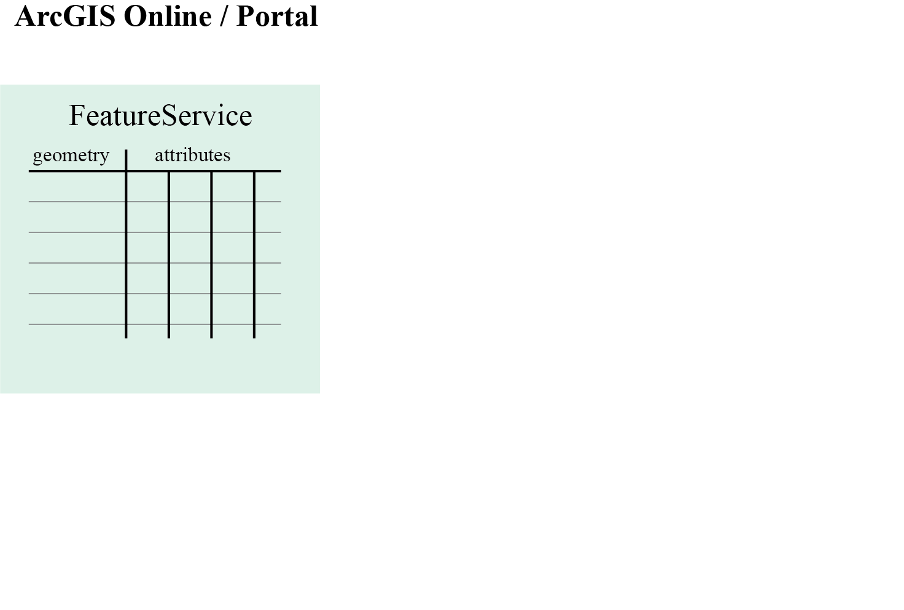

---

<!-- .slide: data-background="images/bg-2.png" -->

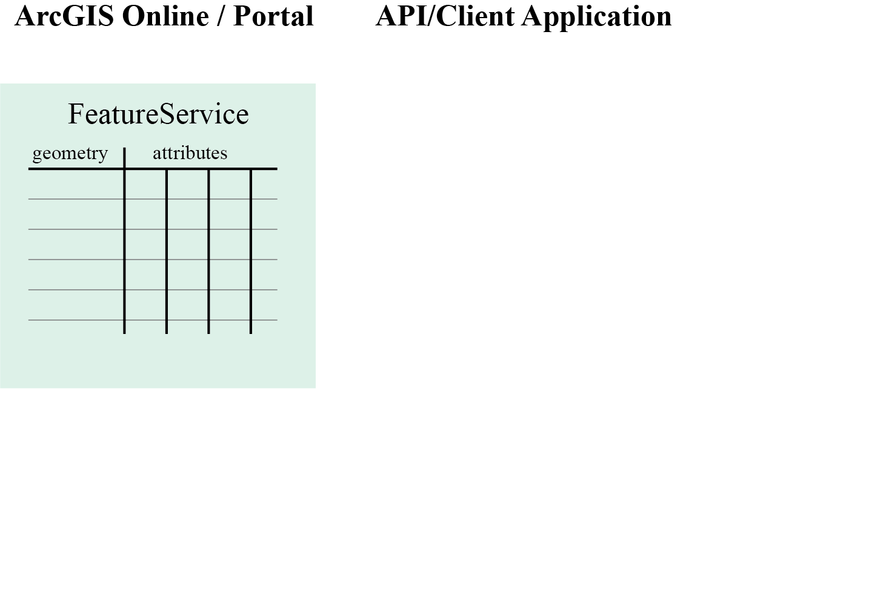

---

<!-- .slide: data-background="images/bg-2.png" -->

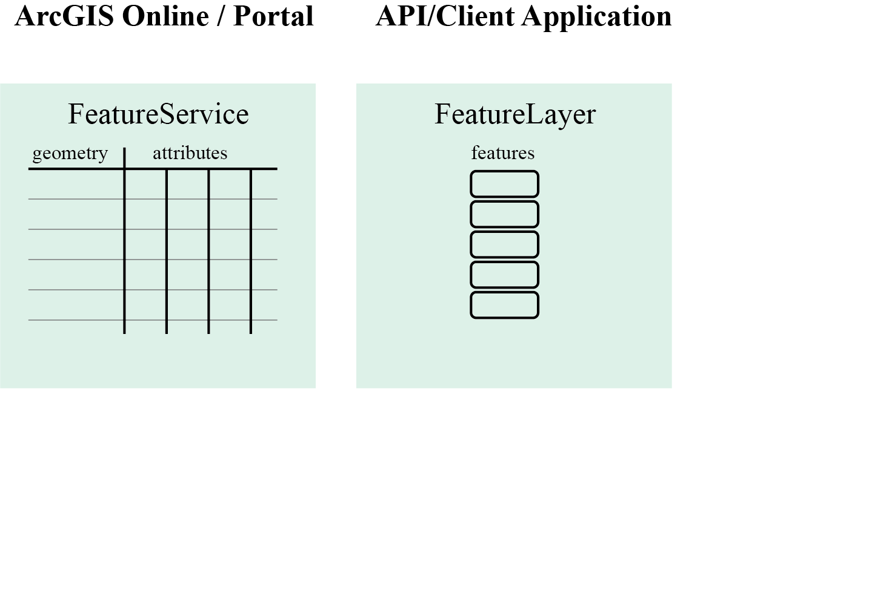

---

<!-- .slide: data-background="images/bg-2.png" -->

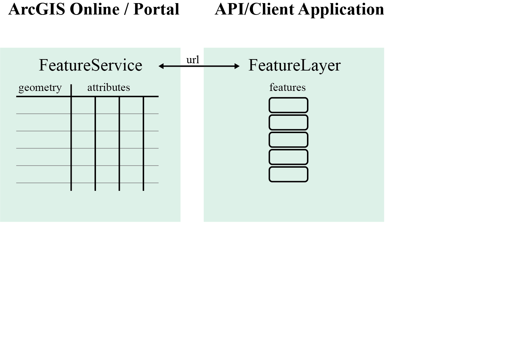

---

<!-- .slide: data-background="images/bg-2.png" -->

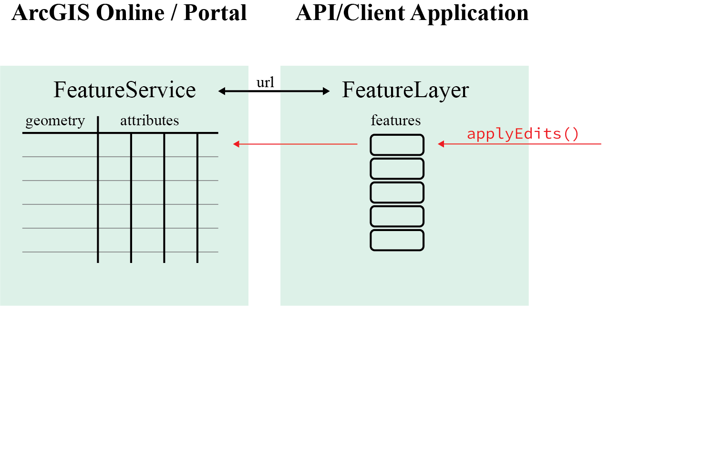

---

<!-- .slide: data-background="images/bg-2.png" -->

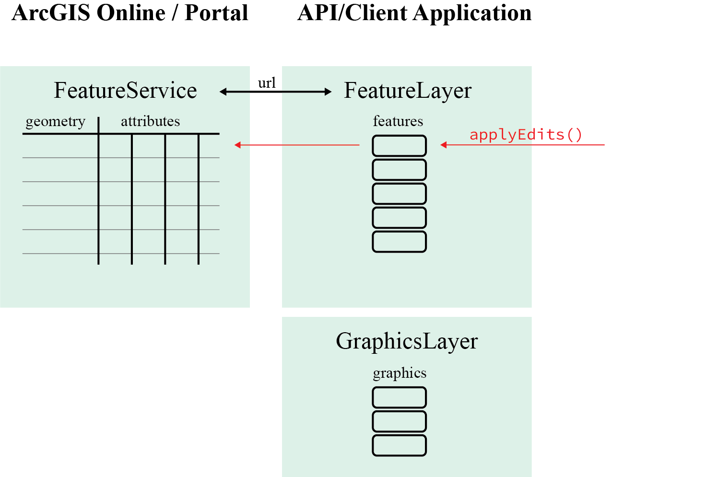

---

<!-- .slide: data-background="images/bg-2.png" -->

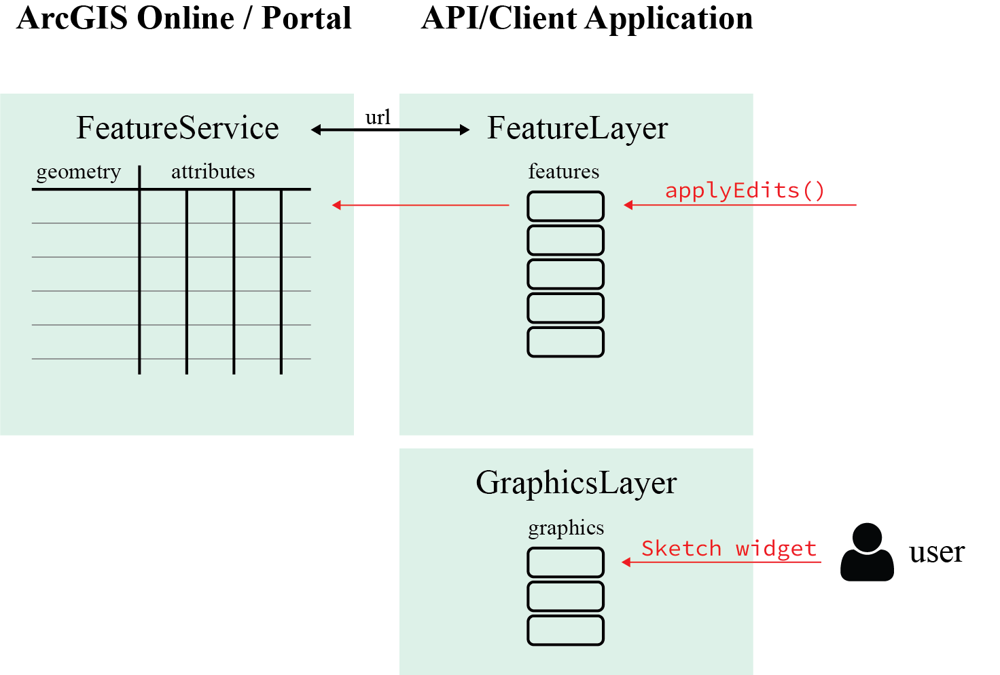

---

<!-- .slide: data-background="images/bg-2.png" -->

### Sketch widget

<div class="two-columns">
  <div class="left-column">
  <div class="code-snippet">
    <button class="play" id="addSketch"></button>

```ts
const sketch = new Sketch({
  layer: layer,
  view: view
});
view.ui.add(sketch, "top-right");
```
  </div>
  </div>
  <div class="right-column">
    <iframe data-src="./samples/bim-editing/feature-editing/basic/index-sketch.html" ></iframe>
  </div>
</div>

---

<!-- .slide: data-background="images/bg-2.png" -->


---

<!-- .slide: data-background="images/bg-2.png" -->

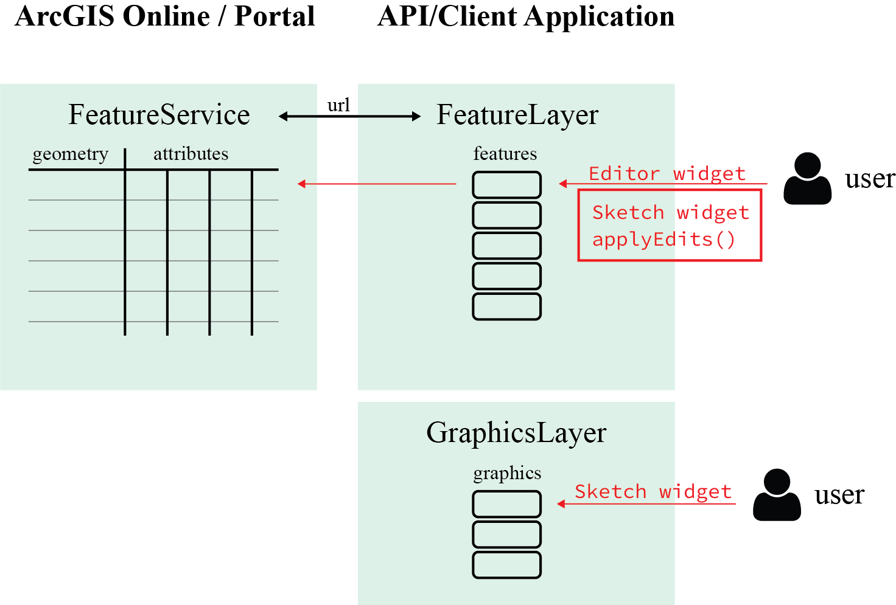


---

<!-- .slide: data-background="images/bg-2.png" -->

### Editor widget

<div class="two-columns">
  <div class="left-column">
  <div class="code-snippet">
    <button class="play" id="addEditor"></button>

```ts
// Create the Editor 💥
var editor = new Editor({ view: view });
view.ui.add(editor, "top-right");
```
  </div>
  </div>
  <div class="right-column">
    <iframe data-src="./samples/web-editing/3d-basic-editing/index-basic-editing.html" ></iframe>
  </div>
</div>


---

<!-- .slide: data-background="images/bg-2.png" -->


---

<!-- .slide: data-background="images/bg-2.png" -->

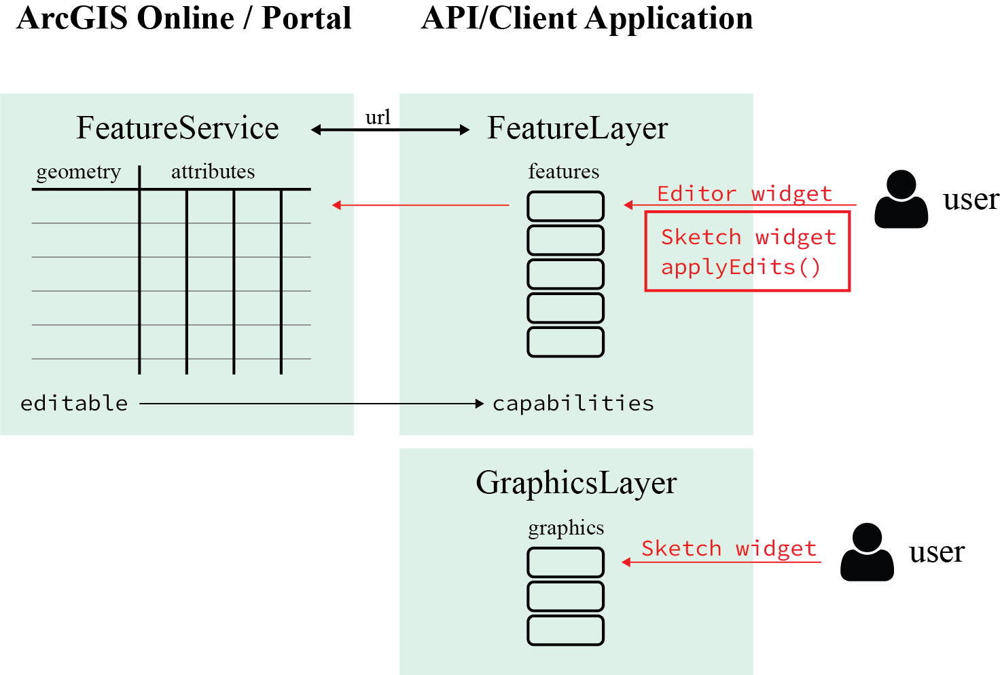

---

<!-- .slide: data-background="images/bg-2.png" -->

### Setting up FeatureService for editing

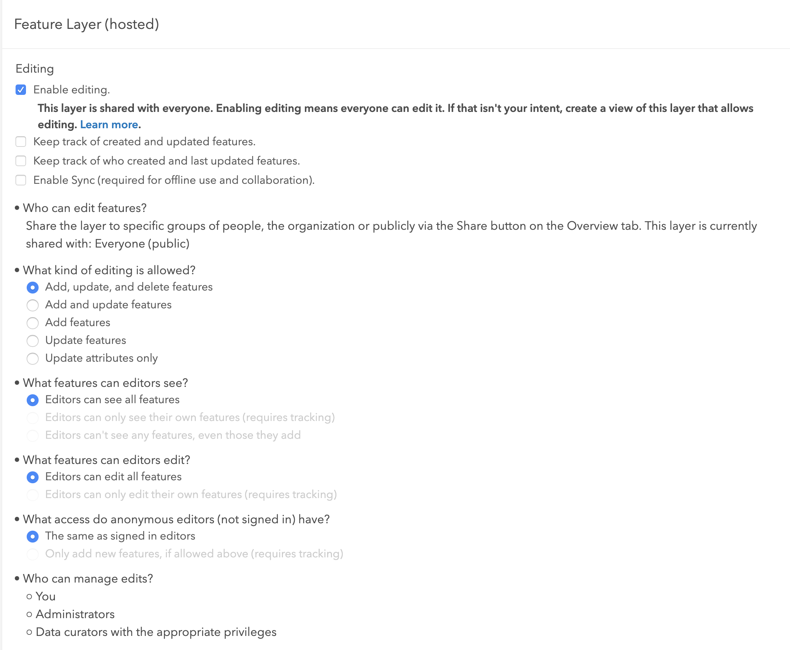

---

<!-- .slide: data-background="images/bg-2.png" -->

### Advanced 3d editing example

<div>
<iframe style="width:70%" data-src="./samples/bim-editing/feature-editing/3d-web-editing-demo/index.html" ></iframe>
</div>

---

<!-- .slide: data-background="images/bg-2.png" -->

### More details on editing see session <br /> "Web Editing in 2D and 3D"

---

<!-- .slide: data-background="images/bg-2.png" -->

## Thank you
