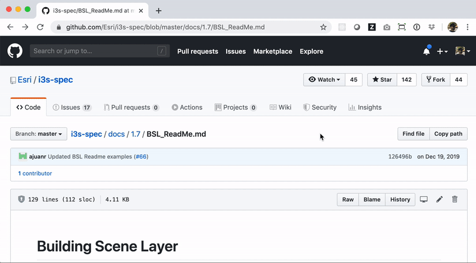
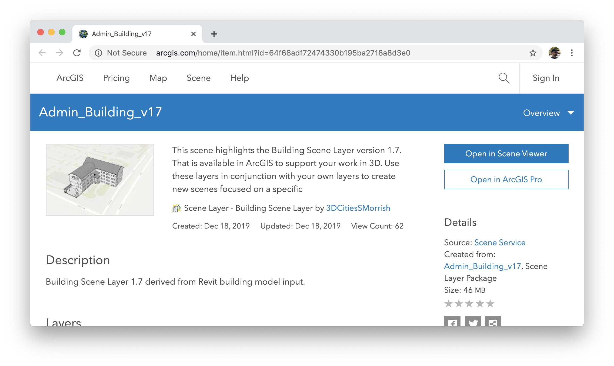

<!-- .slide: data-background="images/bg-1.png" data-title="add-scene-layer" class="title" -->

# ArcGIS API for JavaScript
## Create 3D planning web apps using <br />BIM- and editing capabilities


David Koerner, Esri R&D Center Zürich \
Arno Fiva, Esri R&D Center Zürich

2020 ESRI DEVELOPER SUMMIT​ | Palm Springs, CA

---

<!-- .slide: data-background="images/bg-3.png" -->

## Agenda

- Visualization
- Interactive Tools
- Editing

---

<!-- .slide: data-background="images/bg-2.png" -->

## 3D BIM data in the browser

* Intuitive <!-- .element class="fragment" -->
* Share with anyone <!-- .element class="fragment" -->
* Device support, no additional software required <!-- .element class="fragment" -->

---

<!-- .slide: data-background="images/bg-2.png" -->

## i3s Specification

https://github.com/Esri/i3s-spec/blob/master/docs/1.7/BSL_ReadMe.md

<a href="https://github.com/Esri/i3s-spec/blob/master/docs/1.7/BSL_ReadMe.md" target="_blank">



</a>


---

<!-- .slide: data-background="images/bg-4.png" -->

# Visualizations

---

<!-- .slide: data-background="images/bg-2.png" -->

### BuildingSceneLayer Item

<a href="https://www.arcgis.com/home/item.html?id=64f68adf72474330b195ba2718a8d3e0" target="_blank">



</a>

---

<!-- .slide: data-background="images/bg-2.png" -->

## Load BSL

<div class="two-columns">
  <div class="left-column">

<div class="code-snippet">
<button class="play" id="addBuildingSceneLayer"></button>

```ts
// Load using portal item
var buildingSceneLayer = new BuildingSceneLayer({
  portalItem: {
    id: "64f68adf72474330b195ba2718a8d3e0"
  }
});

// Add to scene
map.add(buildingSceneLayer);
```

```ts
// Load using service URL
var buildingSceneLayer = new BuildingSceneLayer({
  url: "https://tiles.arcgis.com/.../services/" +
   "Admin_Building_v17/SceneServer"
});

// Add to scene
map.add(buildingSceneLayer);
```

</div>


  </div>
  <div class="right-column">
    <iframe data-src="./samples/bim-editing/admin-building/" ></iframe>
  </div>
</div>


---

<!-- .slide: data-background="images/bg-2.png" data-title="slide-bsl-sublayers" -->

## BSL Sublayers

<div class="two-columns">
  <div class="left-column">

<div class="code-snippet">
<button class="play" id="filterBuildingSceneLayer"></button>

```ts
// Iterate through all sublayers
buildingSceneLayer.allSublayers.forEach(l => {

  if (l.title === "Floors" || l.startWith("Structural")) {
    l.visible = true;
  } else {
    l.visible = l.type === "building-group";
  }
});
```

```ts
// Exterior shell (simplified, no interior details)
var shell = buildingSceneLayer.allSublayers.filter(l =>
  l.modelName === "Overview"
);

// Group layer containing all detailed model
var fullModel = buildingSceneLayer.allSublayers.filter(l =>
  l.modelName === "Overview"
);

```
<!-- .element class="fragment" -->

[i3s model names](https://github.com/Esri/i3s-spec/blob/master/docs/1.7/subLayerModelName.md)
<!-- .element class="fragment" -->

</div>


  </div>
  <div class="right-column">
    <iframe data-src="./samples/bim-editing/admin-building/" ></iframe>
  </div>
</div>


---

<!-- .slide: data-background="images/bg-2.png" data-title="slide-bsl-sublayers" -->

## BSL Renderer

<div class="two-columns">
  <div class="left-column">

<div class="code-snippet">
<button class="play" id="renderBuildingSceneLayer"></button>

```ts
// Change windows

```


</div>


  </div>
  <div class="right-column">
    <iframe data-src="./samples/bim-editing/admin-building/" ></iframe>
  </div>
</div>


---

<!-- .slide: data-background="images/bg-2.png" -->

## Filter Blocks

Filter by floors

---

<!-- .slide: data-background="images/bg-2.png" -->

## Filter Modes

Use x-ray and wireframe modes

---

<!-- .slide: data-background="images/bg-4.png" -->

# Interactive Tools

---

<!-- .slide: data-background="images/bg-2.png" -->

## Daylight

---


<!-- .slide: data-background="images/bg-2.png" -->

## Slice

---

<!-- .slide: data-background="images/bg-2.png" -->

## Measurements


---

<!-- .slide: data-background="images/bg-2.png" -->

## Line of Sight

---

<!-- .slide: data-background="images/bg-4.png" -->

# Editing


---

<!-- .slide: data-background="images/bg-2.png" -->

## Thank you
