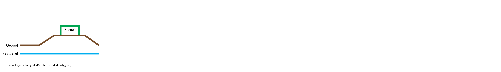
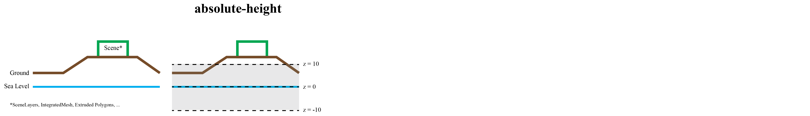
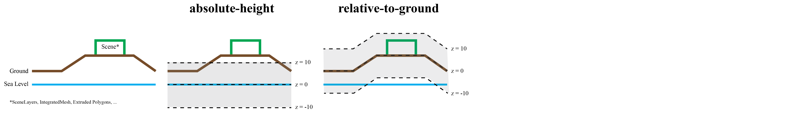
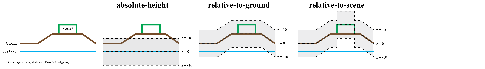
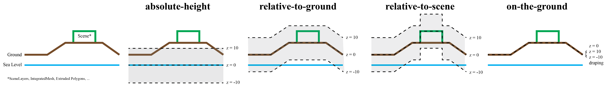

<!-- .slide: data-background="images/bg-1.png" data-title="add-scene-layer" class="title" -->

# ArcGIS API for JavaScript
## Web editing in 3D


David Koerner, Esri R&D Center Zürich

2020 ESRI DEVELOPER SUMMIT​ | Palm Springs, CA

---
<!-- .slide: data-background="images/bg-2.png" -->

## **3d editing workflows**
---

<!-- .slide: data-background="images/bg-2.png" -->

### **`Editor` widget support in SceneView (3D)**

<div class="two-columns">
  <div class="left-column">

  <ul>
  <li>
  works out of the box - no addtitional changes needed
  </li>
  <li>
  pass SceneView to editor
  </li>
  <li>
  use of SketchViewModel, FeatureForm and Editor-widget remains exactly the same as in 2d
  </li>
  </ul>

  <div class="code-snippet">
    <button class="play" id="addEditor"></button>

```ts
// Create the Editor with SceneView
var editor = new Editor({ view: view });
view.ui.add(editor, "top-right");
```
  </div>
  </div>
  <div class="right-column">
    <iframe data-src="./samples/web-editing/3d-basic-editing/index-basic-editing.html" ></iframe>
  </div>
</div>

---

<!-- .slide: data-background="images/bg-3.png" -->

### **Editing support for z values and elevation modes**

---

<!-- .slide: data-background="images/bg-3.png" -->

### **Editing support for z values and elevation modes**

<a href="https://https://jscore.esri.com/javascript/latest/api-reference/esri-layers-FeatureLayer.html#elevationInfo"></a>

---

<!-- .slide: data-background="images/bg-3.png" -->

### **Editing support for z values and elevation modes**

<a href="https://https://jscore.esri.com/javascript/latest/api-reference/esri-layers-FeatureLayer.html#elevationInfo"></a>

---

<!-- .slide: data-background="images/bg-3.png" -->

### **Editing support for z values and elevation modes**

<a href="https://https://jscore.esri.com/javascript/latest/api-reference/esri-layers-FeatureLayer.html#elevationInfo"></a>

---

<!-- .slide: data-background="images/bg-3.png" -->

### **Editing support for z values and elevation modes**

<a href="https://https://jscore.esri.com/javascript/latest/api-reference/esri-layers-FeatureLayer.html#elevationInfo"></a>

---

<!-- .slide: data-background="images/bg-3.png" -->

### **Editing support for z values and elevation modes**

<a href="https://https://jscore.esri.com/javascript/latest/api-reference/esri-layers-FeatureLayer.html#elevationInfo"></a>

---

<!-- .slide: data-background="images/bg-2.png" -->

### **Feature creation**

<div class="two-columns">
  <div class="left-column">
  <div class="code-snippet">
    <button class="play" id="create0"></button>

```ts
// featureLayerWithoutZ.capabilities.data.supportsZ == false
view.map.add(featureLayerWithoutZ);
```
  </div>
  <div class="code-snippet">
    <button class="play" id="create1"></button>

```ts
// featureLayerWithZ.capabilities.data.supportsZ == true
view.map.add(featureLayerWithZ);
```
  </div>
  <div class="code-snippet">
    <button class="play" id="create2"></button>

```ts
view.map.add(extrudedPolygonFeatureLayer);
```
  </div>

  <div class="code-snippet">
    <button class="play" id="create3"></button>

```ts
editor.supportingWidgetDefaults = {
  sketch:{
    polygonSymbol: featureLayer.renderer.symbol
  }
};
```
  </div>

  <div class="code-snippet">
    <button class="play" id="create4"></button>

```ts
featureLayerWithoutZ.elevationInfo = {mode: "relative-to-scene"};
```
  </div>

  <div class="code-snippet">
    <button class="play" id="create5"></button>

```ts
var clonedRenderer = featureLayerWithoutZ.renderer.clone();
clonedRenderer.symbol = createPathSymbol();
featureLayerWithoutZ.renderer = clonedRenderer;
```
  </div>
  </div>
  <div class="right-column">
    <iframe data-src="./samples/web-editing/3d-basic-editing/index-create-options.html" ></iframe>
  </div>
</div>

---

<!-- .slide: data-background="images/bg-3.png" -->

### **Feature updating**

<div class="two-columns">
  <div class="left-column">
  <div class="code-snippet">
    <button class="play" id="updateSketch"></button>

```ts
editor.supportingWidgetDefaults = {
  sketch:{
    defaultUpdateOptions:{
      enableZ: false
    }
  }
};
```
  </div>
  </div>
  <div class="right-column">
    <iframe data-src="./samples/web-editing/3d-basic-editing/index-update-options.html" ></iframe>
  </div>
</div>

---

<!-- .slide: data-background="images/bg-3.png" -->

### **Editing data with visual variables**


<div class="two-columns">
  <div class="left-column">
  <div class="code-snippet">
    <button class="play" id="applySizeVisualVariable"></button>

```ts
function applySizeVisualVariable(){
  const renderer = cubesFeatureLayer.renderer.clone();
  renderer.visualVariables = [
    {
      type: "size",
      field: "size",
      valueUnit: "meters"
    }
  ];
  cubesFeatureLayer.renderer = renderer;
}
```
  </div>
  <div class="code-snippet">
    <button class="play" id="applyRotationVisualVariable"></button>

```ts
function applyRotationVisualVariable(){
  const renderer = cubesFeatureLayer.renderer.clone();
  renderer.visualVariables = [
    {
      type: "rotation",
      field: "rotation",
      rotationType: "geographic"
    }
  ];
  cubesFeatureLayer.renderer = renderer;
}
```
  </div>
    <div class="code-snippet">
    <button class="play" id="visualVariableUpdate"></button>

```ts
editor.supportingWidgetDefaults = {
  sketch:{
    defaultUpdateOptions:{
      enableRotation: false,
      enableScaling: false
    }
  }
};
```
  </div>

  </div>
  <div class="right-column">
    <iframe data-src="./samples/web-editing/3d-basic-editing/index-editing-visual-variables.html" ></iframe>
  </div>
</div>

---


<!-- .slide: data-background="images/bg-3.png" -->

### **Update client application graphics from feature edits**

<div class="two-columns">
  <div class="left-column">
  <div class="code-snippet">
    <button class="play" id="sync0"></button>

```ts
function createClientGraphics(){ ... }
```
  </div>
  <div class="code-snippet">
    <button class="play" id="sync1"></button>

```ts
function synchronizeClientGraphics( objectid ){
  const query = featureLayer.createQuery();
  query.returnZ = true;
  query.objectIds = [objectid];
  featureLayer.queryFeatures(query).then(function(featureSet){
    synchronizeClientGraphicsFromFeature(featureSet.features[0]);
  });
}
featureLayer.on("edits", function(edits){
  edits.updatedFeatures.forEach( function(feature){
    synchronizeClientGraphics(feature.objectId);
  });
});
```
  </div>
  <div class="code-snippet">
    <button class="play" id="sync2"></button>

```ts
editor.viewModel.sketchViewModel.on("update", function(e){
  if(e.state == "active"){
    synchronizeClientGraphicsFromFeature(e.graphics[0]);
  }
});
```
  </div>
  </div>
  <div class="right-column">
    <iframe data-src="./samples/web-editing/3d-basic-editing/index-synchronization.html" ></iframe>
  </div>
</div>

---

<!-- .slide: data-background="images/bg-2.png" -->

## Advanced 3d editing example

<div>
<iframe style="width:70%" data-src="./samples/web-editing/3d-web-editing-demo/index.html" ></iframe>
</div>

---

<!-- .slide: data-background="images/bg-2.png" -->

## Thank you
